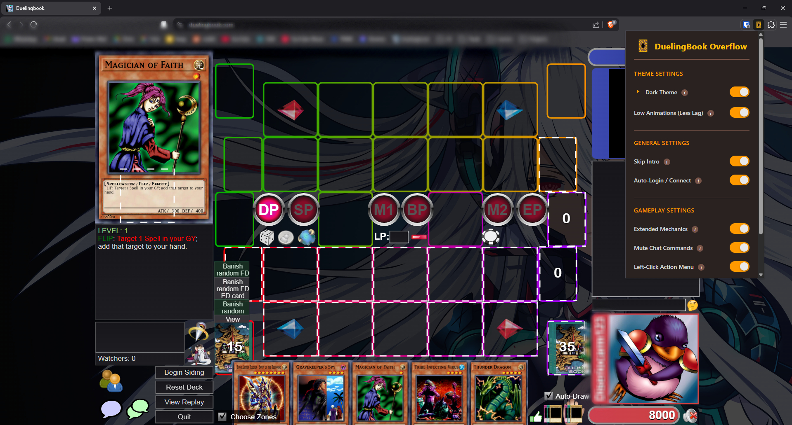

  

<h1 align="center">DuelingBook Overflow</h1>

  <strong>Version 1.1</strong> · A feature-packed browser extension for Duelingbook.com

  <a href="#features">Features</a> •
  <a href="#installation">Installation</a> •
  <a href="#credits--acknowledgements">Credits</a>

---

DuelingBook Overflow unlocks hidden game mechanics, refines the user interface, and adds powerful automation tools to enhance your dueling experience.

> **The goal of this project is to unify all the features I personally use from various extensions into a single, cohesive package.**

  

## Installation

> [!NOTE]
> This repository contains two manifest files: `chrome_manifest.json` and `firefox_manifest.json`. Before installing, rename the one corresponding to your browser to `manifest.json`.

### Chrome / Edge / Brave
1. Download or clone this repository.
2. Rename `chrome_manifest.json` to `manifest.json`.
3. Go to `chrome://extensions` (or the equivalent for your browser).
4. Enable **Developer Mode**.
5. Click **Load unpacked** and select the extension folder.

### Firefox
1. Download or clone this repository.
2. Rename `firefox_manifest.json` to `manifest.json`.
3. Go to `about:debugging#/runtime/this-firefox`.
4. Click **Load Temporary Add-on** and select the `manifest.json` file.

---

## Features

### 🎨 Theme Settings

| Feature | Description |
|---------|-------------|
| **Dark Theme** | A sleek, modern dark theme for the entire website. Includes a custom background image option. |
| **Low Animations** | Speeds up card animations (2x) and disables the flashing dotted-line zone selection animations for better performance. |

### ⚙️ General Settings

| Feature | Description |
|---------|-------------|
| **Skip Intro** | Automatically skips the landing page "Enter" animation. |
| **Auto-Login / Connect** | Instantly enters the main menu by auto-clicking the "Duel" button. Respects manual logout to prevent loops. |

### 🎮 Gameplay Settings

| Feature | Description |
|---------|-------------|
| **Extended Mechanics** | Unlocks natively unavailable actions like *Attack from Pendulum Scale*, *Set Spell from Hand*, *Shuffle to Opponent's Deck*, *Pay Half LP*, *Summon Tokens*, *Excavate*, *Attach from Hand*, *Banish Face-Down*, and more. |
| **Mute Chat Commands** | Executes chat commands (like `/search` or `/mill`) silently without playing sound effects. |
| **Left-Click Action Menu** | Enhanced mouse interaction: Left-Click opens the card action menu, Double-Click for face-down actions. |
| **Chat Card Logging** | Logs detailed card info to the console for tracking, including opponent's hand content when viewed (e.g., via Trap Dustshoot). |
| **Effect Text Highlighter** | Colors card text based on PSCT (Problem-Solving Card Text): 🟢 Conditions, 🔴 Costs, 🔵 Restrictions. Customizable colors. |

---

## Credits & Acknowledgements

This project acts as a unified fork, combining the best features from different extensions. Special thanks to the following creators:

| Creator | Contribution |
|---------|--------------| 
| **[eyal282](https://github.com/eyal282/chrome-ext-dueling-book-unlock)** | **The Original Creator**. This project is a fork based on his work, serving as the core framework. |
| **[mykesXD](https://github.com/mykesXD/Duelingbook-Dark-Mode)** | Core CSS for the **Dark Theme**. |
| **[alexjraymond](https://github.com/alexjraymond/DuelingBookEnhanced)** | Logic implementation for **Skip Intro** and **Auto-Login**. |

---

  <em>DuelingBook Overflow is a fan-made extension and is not affiliated with Duelingbook.com.</em>

